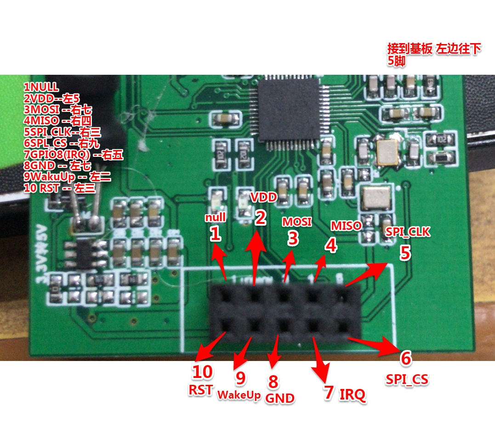

# 新版基站开发
## 9.7 
1. 初始化失败
    1. 新版基站初始化失败
        1. 已经做了的
            1. 电源
        2. 要做
            1. 接口对不对
            2. 接线会不会松
            3. 做电路对比
        3. 记录
            1. 接口记录
                1. 
            2. 上电后仍旧初始化失败
            3. 使用老版标签初始化成功，排除软件问题
            4. 新版几块板子都没有用
            5. 去掉C36,有源晶振没有接电源
2. 两个新版标签之间通信